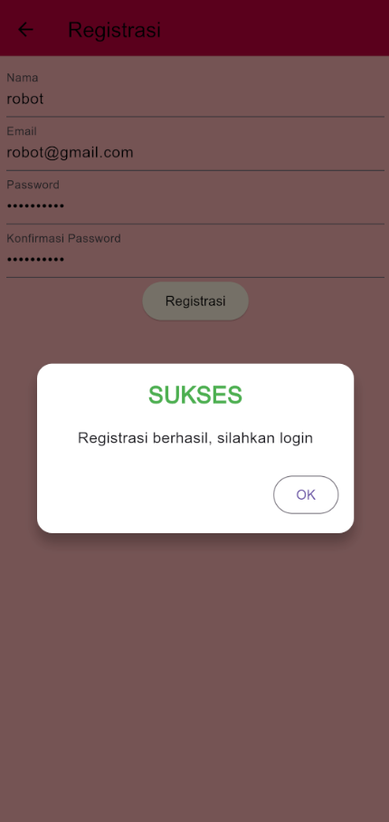

# manajemen_pariwisata (Responsi 1 Pemrograman Mobile)

Nama: Reyno Alfarez Marchelian
NIM: H1D022111
Shift B

## Screenshot

1. Login

2. Registrasi

3. Registrasi Berhasil

4. Login Gagal

5. List Harga Tiket

6. Sidemenu

7. Detail Tiket

8. Edit tiket

9. List Harga Tiket Setelah Di-edit

10. Konfirmasi Penghapusan Tiket

11. List Harga Tiket Setelah Dihapus

12. Tambah tiket

13. List Harga Tiket Setelah Ditambah

